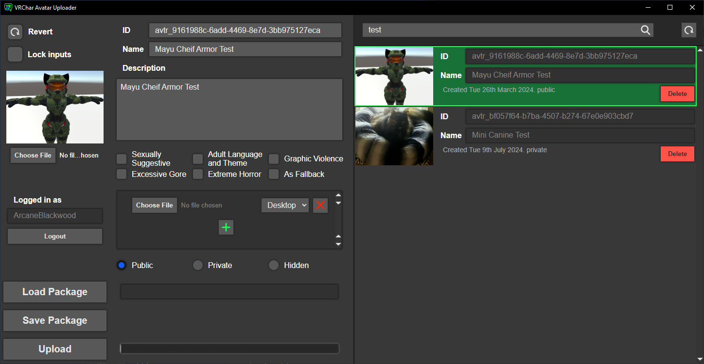

### VRChat Avatar Uploader
A simple program to upload avatars to VRChat.  Built for Avatar creators to distribute avatars to their clients without the need to request login details.

## 🚨 Currently nonfunctional!
Still working out some bugs.  If anyone has any advice Id be very happy to accept!

VRChat flags any uploaded avatars with "Security checks failed".  Maybe the package building from unity is missing something?  Possible that building the testing file misses some critical information inside the bundle that the typical build does?

<p align="center">
  
</p>


# BUILDING VRCA FILES FROM UNITY

To create exportable vrcpa files, you will need to use VRChat SDK's `Build & Test` option in the builder tab.  The files will be outputted to `%APPDATA%\AppData\LocalLow\VRChat\VRChat\Avatars\PREFAB_NAME.vrca`.  Note that the file will have the same name as your models game object.

Although for Quest its a little more difficult. Currently, the UI does not allow test building, though the VRChat SDK is completely capable of assembling a file. With some basic modifications to the UI code we can enable test building for Quest. All the modifications will be done in the file `YOUR_PROJECT\Packages\com.vrchat.avatars\Editor\VRCSDK\SDK3A\VRCSdkControlPanelAvatarBuilder.cs`.

Find (Control+F) the term `Avatar testing is only supported on Windows`
And comment out the code with slashes like:
```
	//if (testAvatar && Tools.Platform != "standalonewindows")
	//{
	//    throw new BuilderException("Avatar testing is only supported on Windows");
	//}
```

Find the term `You must fix the issues listed above before you can do an Offline Test`
And a few lines above insert `EditorUserBuildSettings.activeBuildTarget == BuildTarget.Android ||`
So it looks something like this:
```
var localBuildsAllowed = (EditorUserBuildSettings.activeBuildTarget == BuildTarget.StandaloneWindows ||
  EditorUserBuildSettings.activeBuildTarget == BuildTarget.Android ||  //INSERTED LINE HERE
  EditorUserBuildSettings.activeBuildTarget == BuildTarget.StandaloneWindows64) &&
  ((_builder.NoGuiErrorsOrIssuesForItem(_selectedAvatar) && _builder.NoGuiErrorsOrIssuesForItem(_builder)) || APIUser.CurrentUser.developerType ==
    APIUser.DeveloperType.Internal);
```

Find the term `Building and testing on this platform is not supported.`
And comment out the code's `#if` block with slashes like:
```c#
	//#if UNITY_ANDROID || UNITY_IOS
	//  _buildAndTestButton.SetEnabled(false);
	//  _localTestDisabledBlock.RemoveFromClassList("d-none");
	//  _localTestDisabledText.text = "Building and testing on this platform is not supported.";
	//#endif
```